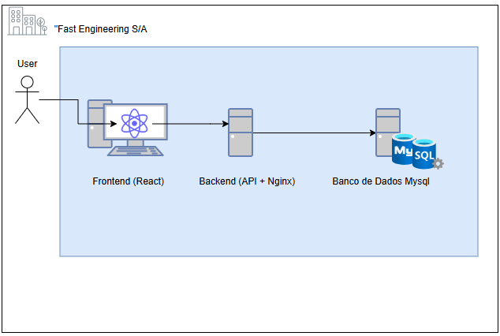
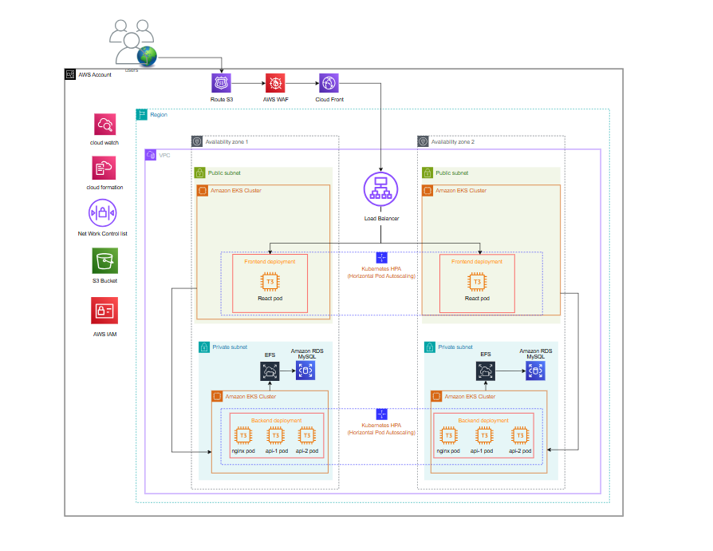

# Atividade - DevSecOps - Projeto Final AWS

## Proposta de Migração para AWS – Fast Engineering S/A

### Empresa executora: TI SOLUÇÕES INCRÍVEIS

# 1. Contexto do Projeto

### A *Fast Engineering S/A* enfrenta um crescimento acelerado em seu e-commerce, causando limitações na infraestrutura atual. A demanda por acessos e compras aumentou significativamente, tornando necessário um ambiente mais escalável, seguro e de alta disponibilidade.

### Diante desse cenário, a melhor solução é migrar a aplicação para a AWS seguindo um processo em duas fases:

_ _ _ _ _
### Fase 1 
 >**Lift-and-Shift (As-Is):**
 >>Migração rápida da infraestrutura atual para a AWS, garantindo continuidade operacional sem grandes mudanças.
### Fase 2
>**Modernização:**
>> Após a migração, otimizar a infraestrutura para Kubernetes e implementar melhores práticas em Cloud AWS.

_ _ _ _ _
_ _ _ _ _
# Diagrama da Infraestrutura atual da empresa *Fast Engineering S/A*

## Fase 1: Lift-and-Shift – Migração As-Is
 Nosso foco nesta etapa é garantir uma transição rápida e segura da aplicação para a AWS, utilizando os serviços 

**AWS MGN (AWS Application Migration Service)**.
   > Para replicação de servidores 

**AWS DMS (Database Migration Service)**.
   > Para migração de banco de dados

# 2. Escopo Detalhado da Migração As-Is

## 2.1. Atividades Necessárias
Para realizar a migração Lift-and-Shift, seguiremos estas etapas:

### Mapeamento da Infraestrutura Atual:
- **Servidor Frontend** (React)
- **Servidor Backend** (3 APIs, Ngnix)
- **Servidor de Banco de Dados** (MySQL)

### Configuração da AWS:
- Criar ambiente na AWS para replicação e testes.

- Configurar **AWS MGN** (Application Migration Service) para replicação contínua dos servidores, de maneira econômica.

 - Configurar **AWS DMS** para migração do banco de dados, minimizando o tempo de inatividade e garantindo a integridade dos dados durante a migração.

- Ajustar permissões e regras de segurança.

### Replicação de Dados e Testes:
- Instalar o **AWS MGN Agent** nos servidores locais para replicação.
- Utilizar o **AWS DMS** para migrar o banco de dados do ambiente local para a AWS, com a replicação contínua dos dados.
- Criar máquinas **EC2** espelhando a infraestrutura atual.
- Testar a aplicação na AWS antes da migração final.

### Cutover (Troca para Produção):
- Redirecionar tráfego para a infraestrutura na AWS.
- Desativar os servidores antigos após validação.

## 2.2. Ferramentas Utilizadas

| **Serviço**         | **Finalidade**                                                                 |
|---------------------|--------------------------------------------------------------------------------|
| **AWS MGN**         | Replicação contínua e migração dos servidores                                  |
| **AWS DMS**         | Migração eficiente e com baixa latência de dados de banco de dados             |
| **Amazon EC2**      | Hospedagem das máquinas migradas                                              |
| **Amazon RDS**      | Banco de dados gerenciado, dependendo do setup atual                           |
| **AWS IAM**         | Controle de acesso e segurança                                                |
| **AWS CloudWatch**  | Monitoramento da infraestrutura                                               |

---

# 2.3  Controle de Segurança Básico para a Migração

A migração será realizada com o seguinte controle de segurança básico para garantir a proteção da infraestrutura:

##  A VPC de Staging

-  Criar um ambiente temporário com uma subnet pública para hospedar o servidor de replicação. Esse servidor recebe os dados do ambiente local por meio do AWS Replication Agent.

##  VPC (Virtual Private Cloud)
- Criar uma **VPC isolada**, com subnets públicas e privadas, para garantir que a rede da AWS esteja isolada e protegida.

##  Security Groups
- Configuração de **Security Groups** para permitir o tráfego de rede apenas entre os recursos autorizados, como servidores backend, frontend e banco de dados.

# 3. Processo de Backup

Embora a migração **Lift-and-Shift** seja realizada rapidamente, a segurança dos dados será priorizada com um processo de backup básico:

## Armazenamento no Amazon S3
- Apenas dados críticos e não voláteis serão armazenados no Amazon S3, de forma otimizada, para garantir segurança e disponibilidade, sem custos elevados de armazenamento.

---

### 4. Custo Estimado na AWS

Abaixo estão os serviços que serão utilizados para migrar e hospedar sua aplicação na AWS, com uma estimativa de custos mensais:

| **Serviço**                          | **Para que serve?**                                                                 | **Custo Estimado (Mensal)** |
|--------------------------------------|------------------------------------------------------------------------------------|-----------------------------|
| **AWS Application Migration Service (MGN)** | Faz a migração dos seus servidores atuais para a AWS de forma contínua e segura. | $0.00*                     |
| **AWS Database Migration Service (DMS)** | Migra o banco de dados da sua aplicação para a AWS com eficiência e baixa latência. | $64.79                     |
| **Amazon EC2 (Frontend React)**      | Hospeda a parte visual da sua aplicação (Frontend).                                 | $4.40 a $15.18             |
| **Amazon EC2 (Backend com APIs e Nginx)** | Hospeda a lógica e as funcionalidades da sua aplicação (Backend).               | $12.15 a $30.37            |
| **Amazon EC2 (Instância Temporária para Migração)** | Uma máquina temporária para ajudar no processo de migração.                  | $63.25                     |
| **Amazon RDS**                       | Banco de dados gerenciado pela AWS para armazenar os dados da sua aplicação.        | $209.93                    |
| **AWS IAM**                          | Controla o acesso e a segurança dos recursos na AWS.                                | $0.00**                    |
| **AWS CloudWatch**                   | Monitora o desempenho e a saúde da sua aplicação na nuvem.                         | $2.10***                   |

**Observações**:  
- *O **AWS MGN** não tem custo direto, mas durante a migração, podem haver custos adicionais de máquinas e armazenamento.  
- **O **AWS IAM** é gratuito e essencial para garantir a segurança dos seus recursos.  
- ***O **AWS CloudWatch** monitora sua aplicação e gera um custo baixo com base no número de métricas analisadas.  

---

### **Total Estimado dos Custos Mensais**

| **Serviço**                          | **Custo Estimado (Mensal)** |
|--------------------------------------|-----------------------------|
| **Migração (AWS MGN)**               | $0.00                       |
| **Migração do Banco de Dados (AWS DMS)** | $64.79                    |
| **Hospedagem do Frontend (EC2)**     | $4.40 a $15.18              |
| **Hospedagem do Backend (EC2)**      | $12.15 a $30.37             |
| **Instância Temporária para Migração (EC2)** | $63.25                |
| **Banco de Dados (Amazon RDS)**      | $209.93                     |
| **Segurança (AWS IAM)**              | $0.00                       |
| **Monitoramento (AWS CloudWatch)**   | $2.10                       |
| **Total**                            | **$355.62 a $385.62**       |

---

### **Explicação dos Custos**

1. **Migração**:
   - O **AWS MGN** não tem custo direto, mas durante a migração, podem haver custos adicionais de máquinas e armazenamento.
   - O **AWS DMS** é usado para migrar seu banco de dados atual para a AWS e tem um custo fixo de **$64.79/mês**.

2. **Hospedagem**:
   - O **Frontend** (parte visual da aplicação) será hospedado em uma máquina virtual (EC2) com custo entre **$4.40 e $15.18/mês**.
   - O **Backend** (lógica e funcionalidades da aplicação) será hospedado em outra máquina virtual (EC2) com custo entre **$12.15 e $30.37/mês**.
   - Uma **instância temporária** será usada durante a migração, com custo de **$63.25/mês**.

3. **Banco de Dados**:
   - O **Amazon RDS** é um banco de dados gerenciado pela AWS, com custo fixo de **$209.93/mês**.

4. **Segurança e Monitoramento**:
   - O **AWS IAM** é gratuito e controla o acesso aos recursos.
   - O **AWS CloudWatch** monitora o desempenho da aplicação, com custo de **$2.10/mês**.

---
---
---

# **Atividades Necessárias para a Modernização**

A modernização envolve transformar a infraestrutura já migrada para uma arquitetura mais escalável, eficiente e automatizada. As atividades para essa modernização incluem:

## 1. Transformação da Aplicação em Containers
- **Dockerizar a aplicação** para que ela seja executada em pods no **Amazon EKS**.

## 2. Implantação no Kubernetes
- Configuração do cluster **Amazon EKS** para orquestrar containers.
- Criação dos **Deployments** no Kubernetes para a aplicação, garantindo alta disponibilidade e escalabilidade.

## 3. Configuração de Auto Scaling e Load Balancer
- Definir políticas de **Auto Scaling** para as instâncias EC2 dos nós do Kubernetes (EKS) com base na carga.
- Configuração do **Load Balancer** para distribuir o tráfego entre os pods de forma eficiente.

## 4. Ajustes nas Subnets
- Ajustar a configuração de subnets públicas para os nós EKS e subnets privadas para o banco de dados **RDS MySQL**.

## 5. Configuração de Rede e Segurança
- Configuração de **Security Groups** e **NACLs** para garantir uma comunicação segura entre os componentes da infraestrutura.
- Implementação de **AWS WAF** para proteger a aplicação contra ataques.

## 6. Monitoramento e Logs
- Implementação do **AWS CloudWatch** para monitoramento de logs, métricas e eventos da infraestrutura.

## 7. Configuração de Backup e Recuperação
- Implementação de backups regulares para o banco de dados **RDS MySQL** e arquivos estáticos em **S3**.

---

---

# Diagrama da Infraestrutura na AWS

Aqui está o diagrama básico da infraestrutura modernizada na AWS:

# Descrição do Fluxo

- **Acesso dos Usuários**: Os usuários acessam a aplicação pela internet.
- **Filtragem de Tráfego**: O tráfego é filtrado pelo AWS WAF e distribuído via Amazon CloudFront.
- **Balanceamento de Carga**: O Load Balancer distribui o tráfego para o Amazon EKS.
- **Dentro da VPC**:
  - **Subnets Públicas**: Contêm os nós EC2 do Amazon EKS.
  - **Subnets Privadas**: Contêm o RDS MySQL e grupos de Auto Scaling.
- **Auto Scaling**: O Auto Scaling Group ajusta a quantidade de instâncias EC2 dos nós Kubernetes conforme a demanda.
- **IAM**: Gerencia o acesso a recursos na AWS.
- **Amazon S3**: Armazena arquivos estáticos e backups.
- **Amazon CloudWatch**: Coleta logs, métricas e eventos da infraestrutura.
---

# Requisitos de Segurança

- **AWS IAM**: Gerenciamento de permissões, garantindo que cada serviço tenha apenas o acesso necessário.
- **AWS WAF**: Proteção contra ataques à aplicação, como SQL Injection e Cross-Site Scripting (XSS).
- **Security Groups e NACLs**: Controle de tráfego entre as subnets públicas e privadas, além do tráfego interno da VPC.
- **Criptografia**: Todos os dados em trânsito e em repouso são criptografados, tanto no RDS MySQL quanto no S3.
- **CloudWatch**: Monitoramento de logs para detectar e alertar sobre comportamentos suspeitos ou falhas de segurança.
- **CloudFront**: Proteção adicional para os recursos estáticos, além de fornecer uma camada extra de segurança e desempenho.
---

# Processo de Backup

1. **RDS MySQL**:
   - Backup automático diário utilizando RDS snapshots.
   - Backups manuais serão feitos conforme a necessidade.
2. **Amazon S3**:
   - Armazenamento de backups de arquivos estáticos e logs.
3. **Amazon CloudWatch Logs**:
   - Monitoramento contínuo e armazenamento de logs para auditoria e recuperação de falhas.
4. **AWS Backup**:
   - Ferramenta para automação do backup de recursos em toda a infraestrutura, incluindo RDS e EFS (se necessário).

---

# Ferramentas Utilizadas

As ferramentas específicas para a modernização são:

| **Ferramenta**               | **Finalidade**                                                                 |
|-------------------------------|--------------------------------------------------------------------------------|
| **Amazon EKS**                | Orquestrar e gerenciar os containers da aplicação.                             |
| **AWS WAF**                   | Proteger a aplicação contra ataques comuns, como SQL Injection e XSS.          |
| **Amazon CloudFront**         | Distribuição de conteúdo (CDN), melhorando a performance e segurança.          |
| **Load Balancer (ELB)**       | Distribuir o tráfego de forma eficiente entre os pods e EC2s.                  |
| **Amazon EC2**                | Hospedagem dos nós do Kubernetes no Amazon EKS (instâncias t3.medium).         |
| **RDS MySQL**                 | Banco de dados MySQL gerenciado pela AWS, configurado nas subnets privadas.    |
| **Network ACLs e Security Groups** | Controle de tráfego e permissões de rede.                                |
| **Amazon S3**                 | Armazenamento de arquivos estáticos e backups.                                 |
| **AWS IAM**                   | Controle de permissões e acesso aos recursos da AWS.                           |
| **Amazon CloudWatch**         | Monitoramento, logs e métricas da infraestrutura.                              |
| **Auto Scaling**              | Ajuste automático das instâncias EC2 conforme a demanda de tráfego.            |
| **AWS Backup**                | Automação do backup de recursos em toda a infraestrutura, incluindo RDS e EFS. |
| **AWS EFS (se necessário)**   | Armazenamento de arquivos compartilhados para aplicações que exigem EFS.       |

# Custo da Infraestrutura na AWS (AWS Calculator)

A estimativa de custo pode ser feita com base nos seguintes componentes:

- **Amazon EKS**: Custo das instâncias EC2 dos nós e o uso do EKS em si (gerenciamento de clusters).
- **EC2 (t3.medium)**: Custo das instâncias que hospedam os nós do Kubernetes.
- **RDS MySQL**: Custo das instâncias do banco de dados e volumes de armazenamento.
- **CloudFront e WAF**: Custo de tráfego e proteção contra ataques.
- **Amazon S3**: Custo com armazenamento de arquivos e backups.
- **Amazon CloudWatch**: Custo de monitoramento, métricas e logs.
- **Auto Scaling**: Custo adicional com instâncias EC2 ajustadas automaticamente.
---

# Conclusão

A modernização para Kubernetes na AWS com Amazon EKS, RDS MySQL e CloudWatch permitirá que a Fast Engineering S/A escale sua infraestrutura de maneira eficiente, segura e com alta disponibilidade. Com a utilização de auto scaling, load balancers e ferramentas de segurança como AWS WAF e IAM, a infraestrutura estará preparada para suportar um tráfego maior, com resiliência e flexibilidade.

Além disso, o monitoramento em tempo real através do CloudWatch, o uso de backups automáticos e criação de snapshots do RDS garantirão que a infraestrutura seja bem mantida, segura e capaz de se recuperar rapidamente de falhas, mantendo a continuidade operacional sem interrupções.
